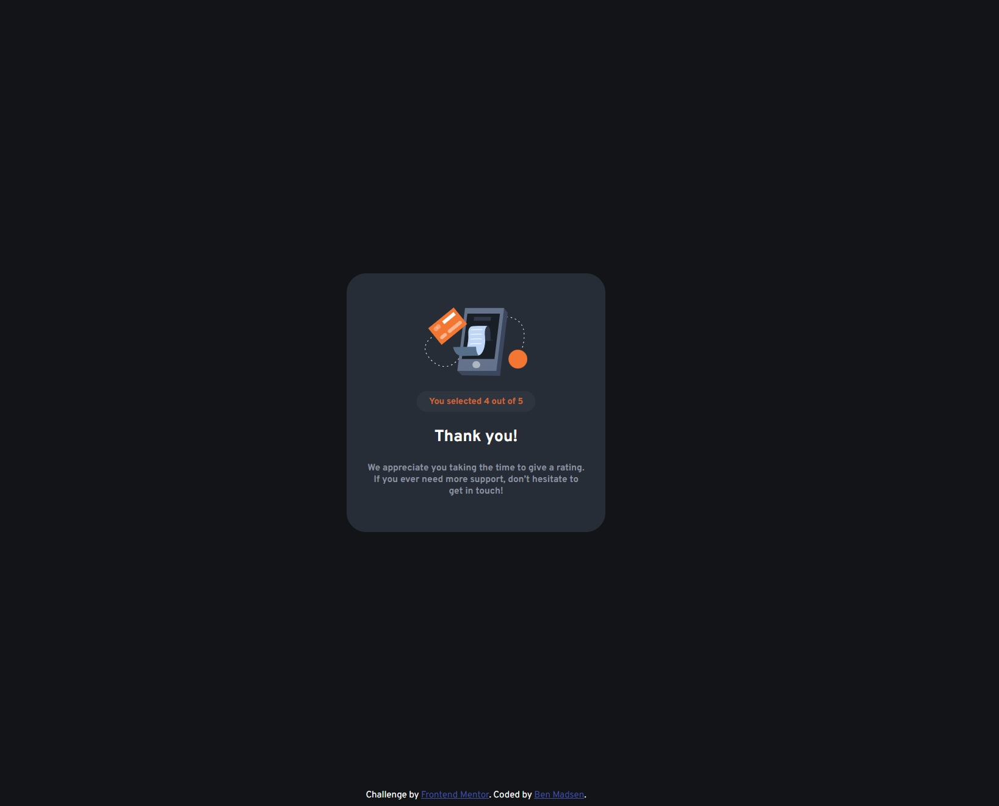

# Frontend Mentor - Interactive rating component solution

This is a solution to the [Interactive rating component challenge on Frontend Mentor](https://www.frontendmentor.io/challenges/interactive-rating-component-koxpeBUmI). Frontend Mentor challenges help you improve your coding skills by building realistic projects.

## Table of contents

- [Overview](#overview)
  - [The challenge](#the-challenge)
  - [Screenshot](#screenshot)
  - [Links](#links)
- [My process](#my-process)
  - [Built with](#built-with)
  - [What I learned](#what-i-learned)
  - [Continued development](#continued-development)
  - [Useful resources](#useful-resources)
- [Author](#author)
- [Acknowledgments](#acknowledgments)

## Overview

### The challenge

Users should be able to:

- View the optimal layout for the app depending on their device's screen size
- See hover states for all interactive elements on the page
- Select and submit a number rating
- See the "Thank you" card state after submitting a rating

### Screenshot

### Links

- Solution URL: [Add solution URL here](https://your-solution-url.com)
- Live Site URL: [Add live site URL here](https://your-live-site-url.com)

## My process

### Built with

- Semantic HTML5 markup
- CSS custom properties
- Flexbox
- Mobile-first workflow
- JavaScript

### What I learned

Overall I'm really happy with the way the process turned out. I felt a little un-easy with being able to actually apply previously leanred knowledge on my own in terms of implimenting the JavaScript into the project. Despite this I was able to logically figure out a process and then found I had the remembered knowledge to actually apply it without having to research or re-search the information needed to complete the project. It really helps to make me feel that in the "Coding Confidence vs Competence" I'm atleast starting to come out of the "Desert of Despair" and into the "Upswing of Awesome" :-D.

### Continued development

Future focus based on this project would be to complete this as an actual form that can be submitted to a database set up such as Mongo DB. As well I would like to be able to add an actual pop up window if no rating has been selected when submitting instead of just using the alert function.

### Useful resources

- [Stack Overflow](https://stackoverflow.com/questions/356809/best-way-to-center-a-div-on-a-page-vertically-and-horizontally) - The top answer on this post really helped with ensuring my object is centered horizontally and vertically on the page.

## Author

- Website - [BK Madsen](https://www.bkmadsen.com)
- Frontend Mentor - [@MadsenBK](https://www.frontendmentor.io/profile/MadsenBK)

## Acknowledgments

Id like to acknowledge @md_mark for their comment on one of my previous submission to use the <main> and <footer> elements instead of a divs as this also helped with being able to correctly ensure my object is centered on the page with out the attribution disturbing the centering of my object.
